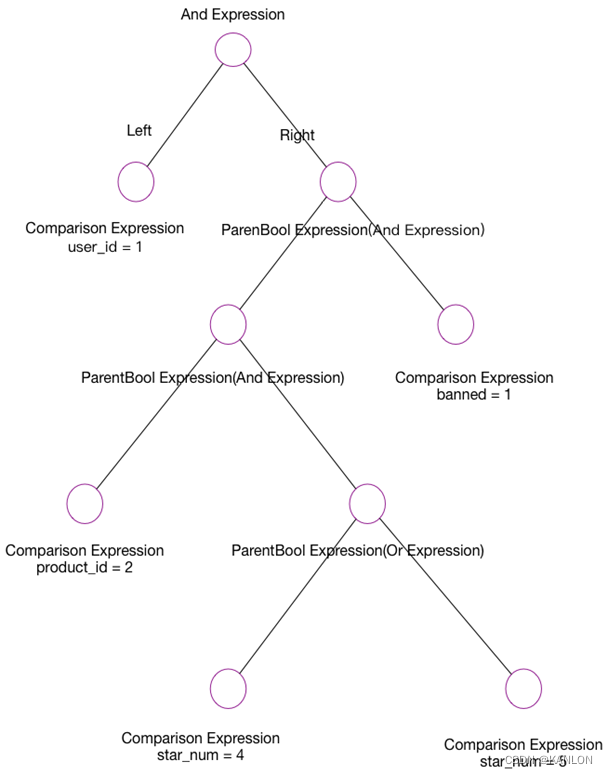

# elasticsearch-sql

Convert Elasticsearch DSL to SQL Or Convert Sql To Elasticsearch DSL 

这个项目主要是将ElasticSearch DSL 转成 SQL 或者将 SQL 转成 ElasticSearch DSL 的工具模块 

#  使用说明

maven 引用

```pom

<dependency>
    <groupId>com.github.kanlon</groupId>
    <artifactId>elasticsearch-sql</artifactId>
    <version>1.0-SNAPSHOT</version>
</dependency>

```

主要使用这个工具类 ： SQLToEsDSLUtils


然后按照如下单元测试例子中直接使用即可将SQL转为ES 的DSL 语言


# 代码示例

```java
public class SqlToEsDslUtilsTest {
    /**
     * 测试sql es dsl
     */
    @Test
    public void testSqlToEsDsl() {
        String sql1 = "select appid,uid,`dt`,dt_time,time from    default.test_t1 where dt_time>='202105081313+0800' and dt_time <='202105081413+0800' and appid = '15013' and uid in ('2524712316','2706555022')  order by dt_time desc,time desc limit 0,5";
        String sql2 = "select count(1) from    default.test_t2 where dt='12' and country like '%张三%'";
        String sql3 = "select * from    default.test_t3 where dt='asdf' limit 10 ";
        String sql4 = "select count(1) from ( select * from    default.test_t4 where dt='asdf' limit 10 union all  select * from    default.test_t3 where dt='asdf' limit 10  union all  select * from    default.test_t4 where dt='asdf' limit 10 )t ";
        String sql5 = "select * from    default.test_t5 where dt='adsf' union all  select * from    default.test12 where dt='12'  union all  select * from    default.test_t7 where dt='12' order by desc  limit 10 ";
        String sql6 = "SELECT * FROM `default.test_t6` WHERE dt_time >= '202105091817+0800'  AND dt_time <= '202105111817+0800'  AND country LIKE '%中国黑龙江绥化%' UNION ALL SELECT * FROM `default.test_t7` WHERE dt_time >= '202105091817+0800'  AND dt_time <= '202105111817+0800'  AND country LIKE '%中国黑龙江绥化%' UNION ALL SELECT * FROM `default.test_t123` WHERE dt_time >= '202105091817+0800'  AND dt_time <= '202105111817+0800'  AND country LIKE '%中国黑龙江绥化%' LIMIT 10";
        String sql7 = "SELECT count(1) AS num FROM (  SELECT *  FROM `default.test_t7`  WHERE dt_time >= '202105092057+0800'   AND dt_time <= '202105112057+0800'   AND act = '7609'  UNION ALL  SELECT *  FROM `default.test_t8`  WHERE dt_time >= '202105092057+0800'   AND dt_time <= '202105112057+0800'   AND act = '7609'  UNION ALL  SELECT *  FROM `default.test_t11,`  WHERE dt_time >= '202105092057+0800'   AND dt_time <= '202105112057+0800'   AND act = '7609'  LIMIT 2147483647 ) temp_t ";
        String sql8 = "SELECT * FROM `default.test_t8` WHERE dt_time >= '202105092057+0800'  AND dt_time <= '202105112057+0800'  AND act = '7609' UNION ALL SELECT * FROM `default.test_t11` WHERE dt_time >= '202105092057+0800'  AND dt_time <= '202105112057+0800'  AND act = '7609' UNION ALL SELECT * FROM `default.test_t13` WHERE dt_time >= '202105092057+0800'  AND dt_time <= '202105112057+0800'  AND act = '7609' LIMIT 10";
        try {
            System.out.println("转化sql1的结果：" + SQLToEsDSLUtils.sqlToEsDslQueryBody(sql1));
            System.out.println("转化sql2的结果：" + SQLToEsDSLUtils.sqlToEsDslQueryBody(sql2));
            System.out.println("转化sql3的结果：" + SQLToEsDSLUtils.sqlToEsDslQueryBody(sql3));
            System.out.println("转化sql4的结果：" + SQLToEsDSLUtils.sqlToEsDslQueryBody(sql4));
            System.out.println("转化sql5的结果：" + SQLToEsDSLUtils.sqlToEsDslQueryBody(sql5));
            System.out.println("转化sql6的结果：" + SQLToEsDSLUtils.sqlToEsDslQueryBody(sql6));
            System.out.println("转化sql7的结果：" + SQLToEsDSLUtils.sqlToEsDslQueryBody(sql7));
            System.out.println("转化sql8的结果：" + SQLToEsDSLUtils.sqlToEsDslQueryBody(sql8));
            System.out.println("转化sql1的请求参数结果：" + SQLToEsDSLUtils.sqlToEsSearchRequest(sql1));
            System.out.println("转化sql2的请求参数结果：" + SQLToEsDSLUtils.sqlToEsSearchRequest(sql2));
            System.out.println("转化sql3的请求参数结果：" + SQLToEsDSLUtils.sqlToEsSearchRequest(sql3));
            System.out.println("转化sql4的请求参数结果：" + SQLToEsDSLUtils.sqlToEsSearchRequest(sql4));
            System.out.println("转化sql5的请求参数结果：" + SQLToEsDSLUtils.sqlToEsSearchRequest(sql5));
            System.out.println("转化sql6的请求参数结果：" + SQLToEsDSLUtils.sqlToEsSearchRequest(sql6));
            System.out.println("转化sql7的请求参数结果：" + SQLToEsDSLUtils.sqlToEsSearchRequest(sql7));
            System.out.println("转化sql8的请求参数结果：" + SQLToEsDSLUtils.sqlToEsSearchRequest(sql8));
        } catch (Exception e) {
            e.printStackTrace();
        }
    }
}
```

运行结果

```
转化sql1的结果：{"from":0,"size":5,"query":{"bool":{"must":[{"range":{"dt_time":{"from":"202105081313+0800","to":null,"include_lower":true,"include_upper":true,"boost":1.0}}},{"range":{"dt_time":{"from":null,"to":"202105081413+0800","include_lower":true,"include_upper":true,"boost":1.0}}},{"term":{"appid":{"value":"15013","boost":1.0}}},{"terms":{"uid":["2524712316","2706555022"],"boost":1.0}}],"adjust_pure_negative":true,"boost":1.0}},"_source":{"includes":["dt","uid","appid","time","dt_time"],"excludes":[]},"sort":[{"dt_time":{"order":"desc"}},{"time":{"order":"desc"}}]}
转化sql2的结果：{"query":{"bool":{"must":[{"term":{"dt":{"value":"12","boost":1.0}}},{"wildcard":{"country":{"wildcard":"*张三*","boost":1.0}}}],"adjust_pure_negative":true,"boost":1.0}}}
转化sql3的结果：{"from":0,"size":10,"query":{"bool":{"must":[{"term":{"dt":{"value":"asdf","boost":1.0}}}],"adjust_pure_negative":true,"boost":1.0}}}
转化sql4的结果：{"query":{"bool":{"must":[{"term":{"dt":{"value":"asdf","boost":1.0}}}],"adjust_pure_negative":true,"boost":1.0}}}
转化sql5的结果：{"from":0,"size":10,"query":{"bool":{"must":[{"term":{"dt":{"value":"adsf","boost":1.0}}}],"adjust_pure_negative":true,"boost":1.0}},"sort":[{"desc":{"order":"desc"}}]}
转化sql6的结果：{"from":0,"size":10,"query":{"bool":{"must":[{"range":{"dt_time":{"from":"202105091817+0800","to":null,"include_lower":true,"include_upper":true,"boost":1.0}}},{"range":{"dt_time":{"from":null,"to":"202105111817+0800","include_lower":true,"include_upper":true,"boost":1.0}}},{"wildcard":{"country":{"wildcard":"*中国黑龙江绥化*","boost":1.0}}}],"adjust_pure_negative":true,"boost":1.0}}}
转化sql7的结果：{"query":{"bool":{"must":[{"range":{"dt_time":{"from":"202105092057+0800","to":null,"include_lower":true,"include_upper":true,"boost":1.0}}},{"range":{"dt_time":{"from":null,"to":"202105112057+0800","include_lower":true,"include_upper":true,"boost":1.0}}},{"term":{"act":{"value":"7609","boost":1.0}}}],"adjust_pure_negative":true,"boost":1.0}}}
转化sql8的结果：{"from":0,"size":10,"query":{"bool":{"must":[{"range":{"dt_time":{"from":"202105092057+0800","to":null,"include_lower":true,"include_upper":true,"boost":1.0}}},{"range":{"dt_time":{"from":null,"to":"202105112057+0800","include_lower":true,"include_upper":true,"boost":1.0}}},{"term":{"act":{"value":"7609","boost":1.0}}}],"adjust_pure_negative":true,"boost":1.0}}}
转化sql1的请求参数结果：SearchRequest{searchType=QUERY_THEN_FETCH, indices=[default.test_t1], indicesOptions=IndicesOptions[ignore_unavailable=false, allow_no_indices=true, expand_wildcards_open=true, expand_wildcards_closed=false, allow_aliases_to_multiple_indices=true, forbid_closed_indices=true, ignore_aliases=false, ignore_throttled=true], types=[], routing='null', preference='null', requestCache=null, scroll=null, maxConcurrentShardRequests=0, batchedReduceSize=512, preFilterShardSize=128, allowPartialSearchResults=null, localClusterAlias=null, getOrCreateAbsoluteStartMillis=-1, ccsMinimizeRoundtrips=true, source={"from":0,"size":5,"query":{"bool":{"must":[{"range":{"dt_time":{"from":"202105081313+0800","to":null,"include_lower":true,"include_upper":true,"boost":1.0}}},{"range":{"dt_time":{"from":null,"to":"202105081413+0800","include_lower":true,"include_upper":true,"boost":1.0}}},{"term":{"appid":{"value":"15013","boost":1.0}}},{"terms":{"uid":["2524712316","2706555022"],"boost":1.0}}],"adjust_pure_negative":true,"boost":1.0}},"_source":{"includes":["dt","uid","appid","time","dt_time"],"excludes":[]},"sort":[{"dt_time":{"order":"desc"}},{"time":{"order":"desc"}}]}}
转化sql2的请求参数结果：SearchRequest{searchType=QUERY_THEN_FETCH, indices=[default.test_t2], indicesOptions=IndicesOptions[ignore_unavailable=false, allow_no_indices=true, expand_wildcards_open=true, expand_wildcards_closed=false, allow_aliases_to_multiple_indices=true, forbid_closed_indices=true, ignore_aliases=false, ignore_throttled=true], types=[], routing='null', preference='null', requestCache=null, scroll=null, maxConcurrentShardRequests=0, batchedReduceSize=512, preFilterShardSize=128, allowPartialSearchResults=null, localClusterAlias=null, getOrCreateAbsoluteStartMillis=-1, ccsMinimizeRoundtrips=true, source={"query":{"bool":{"must":[{"term":{"dt":{"value":"12","boost":1.0}}},{"wildcard":{"country":{"wildcard":"*张三*","boost":1.0}}}],"adjust_pure_negative":true,"boost":1.0}}}}
转化sql3的请求参数结果：SearchRequest{searchType=QUERY_THEN_FETCH, indices=[default.test_t3], indicesOptions=IndicesOptions[ignore_unavailable=false, allow_no_indices=true, expand_wildcards_open=true, expand_wildcards_closed=false, allow_aliases_to_multiple_indices=true, forbid_closed_indices=true, ignore_aliases=false, ignore_throttled=true], types=[], routing='null', preference='null', requestCache=null, scroll=null, maxConcurrentShardRequests=0, batchedReduceSize=512, preFilterShardSize=128, allowPartialSearchResults=null, localClusterAlias=null, getOrCreateAbsoluteStartMillis=-1, ccsMinimizeRoundtrips=true, source={"from":0,"size":10,"query":{"bool":{"must":[{"term":{"dt":{"value":"asdf","boost":1.0}}}],"adjust_pure_negative":true,"boost":1.0}}}}
转化sql4的请求参数结果：SearchRequest{searchType=QUERY_THEN_FETCH, indices=[default.test_t4, default.test_t3], indicesOptions=IndicesOptions[ignore_unavailable=false, allow_no_indices=true, expand_wildcards_open=true, expand_wildcards_closed=false, allow_aliases_to_multiple_indices=true, forbid_closed_indices=true, ignore_aliases=false, ignore_throttled=true], types=[], routing='null', preference='null', requestCache=null, scroll=null, maxConcurrentShardRequests=0, batchedReduceSize=512, preFilterShardSize=128, allowPartialSearchResults=null, localClusterAlias=null, getOrCreateAbsoluteStartMillis=-1, ccsMinimizeRoundtrips=true, source={"query":{"bool":{"must":[{"term":{"dt":{"value":"asdf","boost":1.0}}}],"adjust_pure_negative":true,"boost":1.0}}}}
转化sql5的请求参数结果：SearchRequest{searchType=QUERY_THEN_FETCH, indices=[default.test_t5, default.test12, default.test_t7], indicesOptions=IndicesOptions[ignore_unavailable=false, allow_no_indices=true, expand_wildcards_open=true, expand_wildcards_closed=false, allow_aliases_to_multiple_indices=true, forbid_closed_indices=true, ignore_aliases=false, ignore_throttled=true], types=[], routing='null', preference='null', requestCache=null, scroll=null, maxConcurrentShardRequests=0, batchedReduceSize=512, preFilterShardSize=128, allowPartialSearchResults=null, localClusterAlias=null, getOrCreateAbsoluteStartMillis=-1, ccsMinimizeRoundtrips=true, source={"from":0,"size":10,"query":{"bool":{"must":[{"term":{"dt":{"value":"adsf","boost":1.0}}}],"adjust_pure_negative":true,"boost":1.0}},"sort":[{"desc":{"order":"desc"}}]}}
转化sql6的请求参数结果：SearchRequest{searchType=QUERY_THEN_FETCH, indices=[default.test_t6, default.test_t7, default.test_t123], indicesOptions=IndicesOptions[ignore_unavailable=false, allow_no_indices=true, expand_wildcards_open=true, expand_wildcards_closed=false, allow_aliases_to_multiple_indices=true, forbid_closed_indices=true, ignore_aliases=false, ignore_throttled=true], types=[], routing='null', preference='null', requestCache=null, scroll=null, maxConcurrentShardRequests=0, batchedReduceSize=512, preFilterShardSize=128, allowPartialSearchResults=null, localClusterAlias=null, getOrCreateAbsoluteStartMillis=-1, ccsMinimizeRoundtrips=true, source={"from":0,"size":10,"query":{"bool":{"must":[{"range":{"dt_time":{"from":"202105091817+0800","to":null,"include_lower":true,"include_upper":true,"boost":1.0}}},{"range":{"dt_time":{"from":null,"to":"202105111817+0800","include_lower":true,"include_upper":true,"boost":1.0}}},{"wildcard":{"country":{"wildcard":"*中国黑龙江绥化*","boost":1.0}}}],"adjust_pure_negative":true,"boost":1.0}}}}
转化sql7的请求参数结果：SearchRequest{searchType=QUERY_THEN_FETCH, indices=[default.test_t7, default.test_t8, default.test_t11,], indicesOptions=IndicesOptions[ignore_unavailable=false, allow_no_indices=true, expand_wildcards_open=true, expand_wildcards_closed=false, allow_aliases_to_multiple_indices=true, forbid_closed_indices=true, ignore_aliases=false, ignore_throttled=true], types=[], routing='null', preference='null', requestCache=null, scroll=null, maxConcurrentShardRequests=0, batchedReduceSize=512, preFilterShardSize=128, allowPartialSearchResults=null, localClusterAlias=null, getOrCreateAbsoluteStartMillis=-1, ccsMinimizeRoundtrips=true, source={"query":{"bool":{"must":[{"range":{"dt_time":{"from":"202105092057+0800","to":null,"include_lower":true,"include_upper":true,"boost":1.0}}},{"range":{"dt_time":{"from":null,"to":"202105112057+0800","include_lower":true,"include_upper":true,"boost":1.0}}},{"term":{"act":{"value":"7609","boost":1.0}}}],"adjust_pure_negative":true,"boost":1.0}}}}
转化sql8的请求参数结果：SearchRequest{searchType=QUERY_THEN_FETCH, indices=[default.test_t8, default.test_t11, default.test_t13], indicesOptions=IndicesOptions[ignore_unavailable=false, allow_no_indices=true, expand_wildcards_open=true, expand_wildcards_closed=false, allow_aliases_to_multiple_indices=true, forbid_closed_indices=true, ignore_aliases=false, ignore_throttled=true], types=[], routing='null', preference='null', requestCache=null, scroll=null, maxConcurrentShardRequests=0, batchedReduceSize=512, preFilterShardSize=128, allowPartialSearchResults=null, localClusterAlias=null, getOrCreateAbsoluteStartMillis=-1, ccsMinimizeRoundtrips=true, source={"from":0,"size":10,"query":{"bool":{"must":[{"range":{"dt_time":{"from":"202105092057+0800","to":null,"include_lower":true,"include_upper":true,"boost":1.0}}},{"range":{"dt_time":{"from":null,"to":"202105112057+0800","include_lower":true,"include_upper":true,"boost":1.0}}},{"term":{"act":{"value":"7609","boost":1.0}}}],"adjust_pure_negative":true,"boost":1.0}}}}
```


# 目前支持的语法

当前只支持条件为and条件连接的，还不支持的复杂的条件嵌套和不支持函数；其他基本就是mysql的语法

查询的表会作为es的index（索引），查询的列作为field（Document中的字段，是文档中的某一个属性）返回 

例如：
 
支持 
```sql
select col1,col2 from t where a in (1) and b =2 and dt>="2022-01-01"
```

不支持
```sql
select col1,col2 from t where a in (1) and b =2 and dt>="2022-01-01" or ( d in (10,22) )
``` 


- [x] SQL Select  
- [x] SQL Where  
- [x] SQL Order by
- [x] SQL And & Or
- [x] SQL In
- [x] SQL like
- [x] SQL Between And
- [x] SQL union all (这个需要确保条件一样，只是查询的表不一样)
- [x] SQL Limit
- [ ] SQL Is
- [ ] SQL Not
- [ ] SQL Null
- [ ] SQL Group by

# 项目功能搭建思路

主要使用Druid的SQL解析工具，将SQL解析成AST(抽象语法树)，然后重新组装为ES的DSL信息
>在计算机科学中，抽象语法树（Abstract Syntax Tree，AST），或简称语法树（Syntax tree），是源代码语法结构的一种抽象表示。它以树状的形式表现编程语言的语法结构，树上的每个节点都表示源代码中的一种结构。


```sql
select * from test_t 
where 
user_id = 1 
and (  
product_id = 2 
and (star_num = 4 or star_num = 5) 
and banned = 1)
```

例如这样SQL 可以转为 以下的AST的结构：



然后根据这样的AST再组装为ES的DSL格式就可以了 
